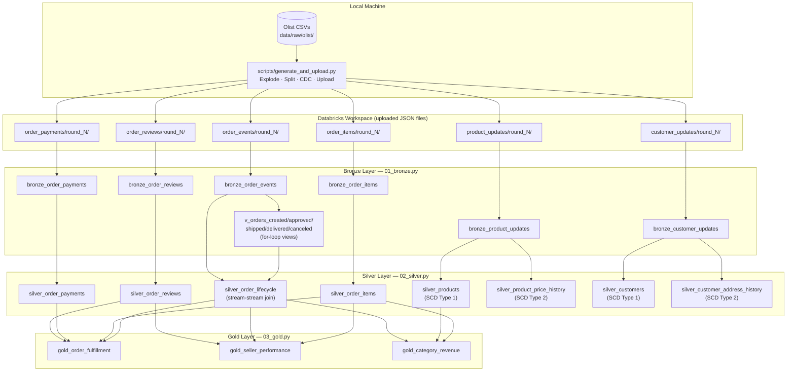

# Architecture

## Overview

This project builds a production-grade Delta Live Tables (DLT) pipeline on the Olist Brazilian
E-Commerce dataset. It demonstrates declarative lakehouse engineering — the same medallion
architecture as the F1 Intelligence project, but expressed as `@dlt.table` declarations rather
than imperative PySpark notebooks. The key distinction is what DLT eliminates: manual CDF reads,
explicit MERGE calls, a custom checkpoint table, and custom validator classes are all replaced by
the DLT framework.

## Architecture Diagram



## Why DLT Over Imperative Notebooks

The F1 Intelligence project uses imperative Databricks notebooks with:
- A custom `helpers.py` with `merge_delta()`, `read_incremental_or_full()`, and `save_checkpoint()`
- A `pipeline_checkpoints` Delta table to track processed versions
- Manual `enable_cdf()` and `enable_liquid_clustering()` calls after every table creation
- A `validators.py` with custom exception classes for Bronze/Silver quality checks

This project replaces all of that with DLT declarations:

| F1 (imperative) | Ecommerce DLT (declarative) |
|---|---|
| `merge_delta()` in helpers.py | `@dlt.table` — DLT materialises and updates |
| CDF reads + checkpoint table | DLT manages incremental state internally |
| `validators.py` custom classes | `@dlt.expect` / `@dlt.expect_or_drop` / `@dlt.expect_or_fail` |
| Manual Liquid Clustering calls | `pipelines.autoOptimize.zOrderCols` table property |
| `read_incremental_or_full()` | `dlt.read_stream()` vs `dlt.read()` via `read_source()` helper |
| Manual SCD ranking + MERGE | `dlt.apply_changes(stored_as_scd_type=N)` |

## DLT Patterns

### For-Loop Table Generation (01_bronze.py)

Five order status values share identical filter logic. Rather than copy-pasting five
`@dlt.view` definitions, a loop generates them from the `order_statuses` list. In a production
pipeline handling many event types this pattern is essential — adding a new status requires
only one list entry change rather than a new view definition.

```python
order_statuses = ["created", "approved", "shipped", "delivered", "canceled"]

for status in order_statuses:
    @dlt.view(name=f"v_orders_{status}")
    def make_status_view(status=status):   # default arg captures loop variable by value
        return dlt.read_stream("bronze_order_events").filter(F.col("order_status") == status)
```

### If-Else Pipeline Mode Branching (02_silver.py, 03_gold.py)

`pipeline.mode` is set in `databricks.yml` per target and can be overridden at runtime.
A single `read_source()` helper centralises the branching so no individual table definition
needs its own if-else:

```python
pipeline_mode = spark.conf.get("pipeline.mode", "incremental")

def read_source(table_name):
    if pipeline_mode == "full_refresh":
        return dlt.read(table_name)
    return dlt.read_stream(table_name)
```

### Three Expectation Severity Levels

| Decorator | Layer | Behaviour | Rationale |
|---|---|---|---|
| `@dlt.expect` | Bronze | Warn, keep row | Raw data is raw — never drop at ingestion |
| `@dlt.expect_or_drop` | Silver | Drop invalid row silently | Bad rows must not reach Gold |
| `@dlt.expect_or_fail` | Gold | Fail the pipeline | Corrupt Gold analytics is worse than no Gold |

### SCD Type 1 and SCD Type 2 (02_silver.py)

Both patterns are demonstrated twice — once for products and once for customers —
using the same source stream as input. This illustrates a common production scenario
where you need both a current-state table and a full-history table from the same CDC feed.

**SCD Type 1** (`silver_products`, `silver_customers`): latest value wins. Use when only the
current state is relevant (e.g., shipping address lookup, current product category).

**SCD Type 2** (`silver_product_price_history`, `silver_customer_address_history`): full history
preserved with `__START_AT` and `__END_AT` columns managed by DLT. Use when historical context
matters (e.g., "what was this product's price when this order was placed?").

`track_history_column_list` restricts which columns generate new history rows — only `price`
and `discount_pct` for products, only `customer_city`, `customer_state`, and `customer_zip` for
customers. Editorial corrections to other fields (photo count, product name length) do not create
unnecessary history rows.

## Data Flow

```
Round 1 (initial load)
  generate_and_upload.py → 6 JSON table directories → pipeline run
  → 6 Bronze tables, 8 Silver tables (incl. SCD base rows), 3 Gold tables

Round 2 (first incremental)
  generate_and_upload.py → new JSON files (new orders + CDC events) → pipeline run
  → Bronze auto-picks up new files via cloudFiles
  → silver_product_price_history grows new history rows (price changes)
  → silver_customer_address_history grows new history rows (relocations)
  → Gold tables update incrementally without full recompute

Round 3 (second incremental)
  Same as round 2. Some products and customers now have 2+ SCD Type 2 history rows.
```

## Unity Catalog

| Level | Name |
|---|---|
| Catalog | `ecommerce_dlt` |
| Dev schema | `ecommerce_dev` |
| Prod schema | `ecommerce_prod` |

All table references inside pipeline notebooks use unqualified names (e.g., `bronze_order_events`)
— DLT resolves them against the catalog and target schema configured in `databricks.yml`.

## Project Structure

```
databricks-ecommerce-dlt-pipeline/
├── databricks.yml                  # DAB bundle: catalog, schema, pipeline_mode per target
├── pyproject.toml                  # ruff config, dev dependencies
├── Makefile                        # install, lint, fmt, validate, deploy-dev/prod
├── pipeline/
│   ├── 01_bronze.py                # cloudFiles ingestion + for-loop status views + inline schemas
│   ├── 02_silver.py                # transformations + APPLY CHANGES INTO (SCD 1+2 pairs)
│   └── 03_gold.py                  # aggregations + if-else on pipeline.mode
├── data/
│   └── ecommerce_data/                  # Pre-prepared JSON dataset (committed, 3 rounds × 6 tables)
├── resources/
│   └── ecommerce_dlt.pipeline.yml  # DLT pipeline DAB resource definition
└── docs/
    ├── ARCHITECTURE.md
    └── EXECUTION.md
```
