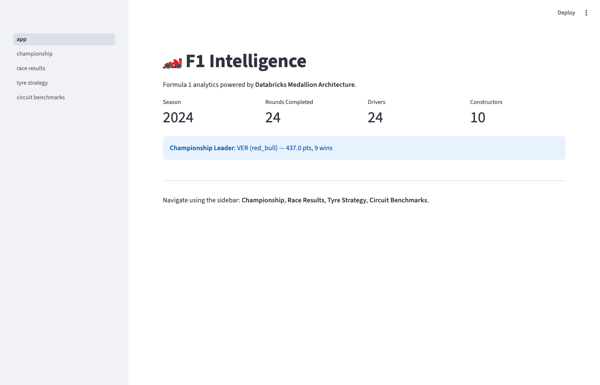
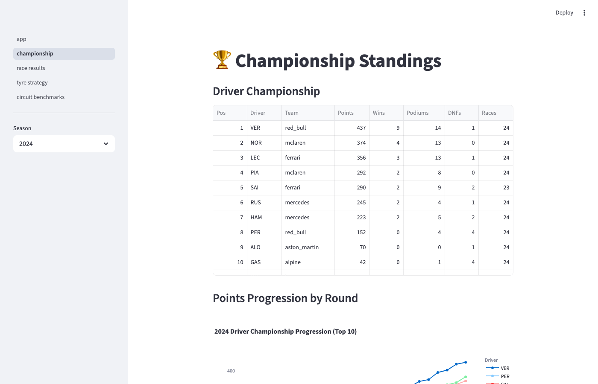
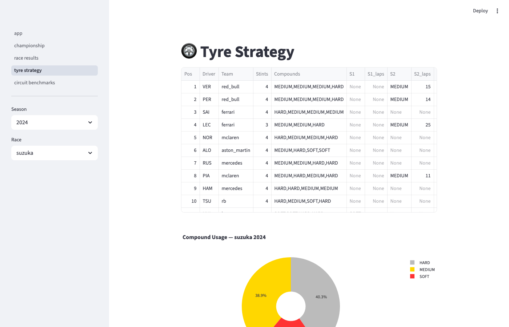
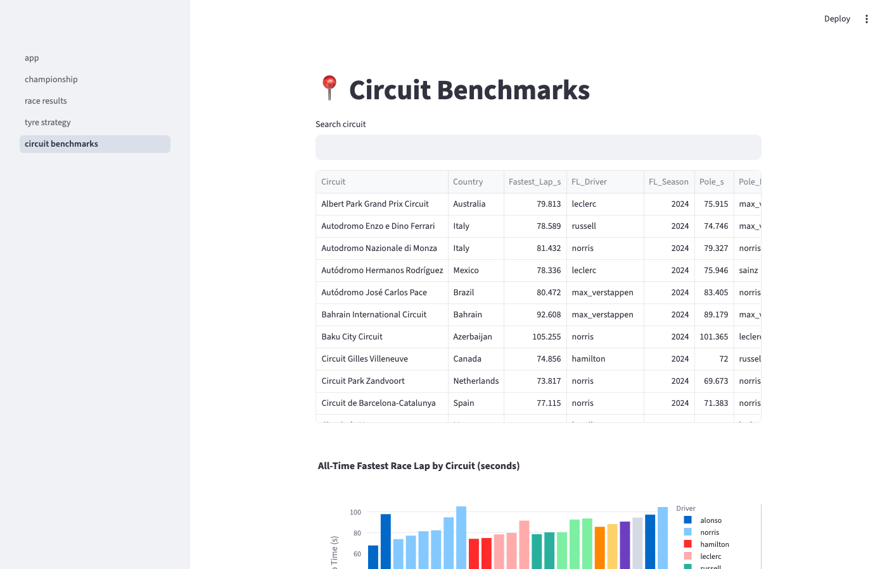

# F1 Intelligence — Databricks Medallion Architecture

End-to-end Formula 1 analytics platform built on Databricks, demonstrating production-grade data engineering patterns including Delta Lake MERGE upserts, Change Data Feed incremental processing, Liquid Clustering, and Delta Time Travel.

## Dashboard

| Home | Championship |
|---|---|
|  |  |

| Tyre Strategy | Circuit Benchmarks |
|---|---|
|  |  |

## Architecture

```
Jolpica-F1 API          OpenF1 API
(results, standings,    (lap timing, tyre
 qualifying, pit stops)  stints, weather)
        |                      |
        v                      v
   [fetch_and_upload.py — runs locally]
        |
        v
   Workspace Parquet files
        |
        v
┌─────────────────────────────────────────────┐
│  BRONZE  (raw Delta, MERGE idempotency)      │
│  bronze_race_results   bronze_laps           │
│  bronze_qualifying     bronze_stints         │
│  bronze_driver_standings                     │
│  bronze_constructor_standings                │
│  bronze_race_schedule  bronze_pit_stops      │
└──────────────────┬──────────────────────────┘
                   │ CDF incremental reads
┌──────────────────v──────────────────────────┐
│  SILVER  (typed, enriched, validated)        │
│  silver_race_results                         │
│  silver_qualifying                           │
│  silver_driver_standings  (position_change)  │
│  silver_constructor_standings  (points_gap)  │
│  silver_lap_analysis  (Jolpica × OpenF1)     │
└──────────────────┬──────────────────────────┘
                   │ CDF incremental reads
┌──────────────────v──────────────────────────┐
│  GOLD  (analytics-ready, genuine MERGE)      │
│  gold_driver_championship    ← MERGE/round   │
│  gold_constructor_championship ← MERGE/round │
│  gold_circuit_benchmarks    ← conditional    │
│  gold_tyre_strategy_report  ← APPEND/race    │
└─────────────────────────────────────────────┘
                   │
        ┌──────────v──────────┐
        │  Streamlit App       │
        │  • Championship      │
        │  • Race Results      │
        │  • Tyre Strategy     │
        │  • Circuit Records   │
        └─────────────────────┘
```

## Key Technical Concepts Demonstrated

| Concept | Where |
|---|---|
| **Delta MERGE upserts** | All Bronze tables (idempotency); Gold standings (in-place updates) |
| **Change Data Feed (CDF)** | Bronze→Silver→Gold incremental reads via checkpoint table |
| **Liquid Clustering** | All Delta tables clustered by (season, round, driver_id) |
| **Delta Time Travel** | Gold notebook — query standings `TIMESTAMP AS OF` any race date |
| **Two-source join** | Silver lap_analysis joins Jolpica race data with OpenF1 telemetry |
| **Databricks Asset Bundles** | Dev/prod deployment via `databricks.yml` |
| **Unity Catalog** | Three-level namespace: `f1_intelligence.f1_dev.*` |

## Data Sources

- **[Jolpica-F1 API](https://api.jolpi.ca/ergast/f1/)** — race results, standings, qualifying, pit stops (no auth required)
- **[OpenF1 API](https://api.openf1.org/)** — lap timing, tyre stints, session weather (no auth for historical)

## Data Scope

- **2024 season**: 24 races, full historical batch load
- **2025 season**: round-by-round incremental load (showcases CDF + Gold MERGE)

## Quick Start

```bash
# 1. Install dependencies
make install

# 2. Authenticate with Databricks
databricks auth login --host https://your-workspace.cloud.databricks.com

# 3. Fetch 2024 season data locally and upload to workspace
make fetch-2024

# 4. Deploy bundle to dev
make deploy-dev

# 5. Run the pipeline
make run-dev
```

See [docs/EXECUTION.md](docs/EXECUTION.md) for the complete step-by-step guide.

## Project Structure

```
databricks-f1-intelligence/
├── databricks.yml                    # Bundle config (catalog, schema, app)
├── pyproject.toml                    # Python package + dependencies
├── Makefile                          # Common operations
├── utils/
│   ├── jolpica.py                    # Jolpica-F1 REST client
│   ├── openf1.py                     # OpenF1 REST client
│   ├── schema.py                     # All StructType definitions + MERGE_KEYS
│   ├── helpers.py                    # Delta MERGE, CDF, checkpoints, clustering
│   └── validators.py                 # Per-layer data quality checks
├── etl/
│   ├── 01_bronze_ingestion.ipynb
│   ├── 02_silver_transformation.ipynb
│   └── 03_gold_aggregation.ipynb
├── resources/
│   └── f1_intelligence_job.job.yml
├── scripts/
│   └── fetch_and_upload.py           # Local fetch with resume support
├── streamlit_app/
│   ├── app.py
│   └── pages/
│       ├── 01_championship.py
│       ├── 02_race_results.py
│       ├── 03_tyre_strategy.py
│       └── 04_circuit_benchmarks.py
└── docs/
    ├── ARCHITECTURE.md
    └── EXECUTION.md
```
