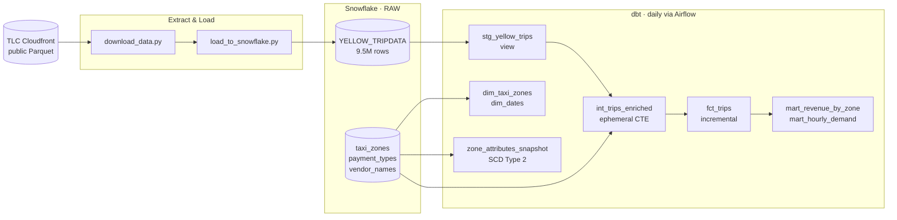

# NYC Taxi Analytics — dbt + Snowflake

An analytics engineering pipeline on the NYC TLC Yellow Taxi Trip Records dataset, built with dbt and Snowflake. This is the sixth project in my data engineering portfolio and the first to use a dedicated transformation layer — all transformation logic lives in version-controlled, tested, documented SQL models rather than in notebooks or Spark jobs.

The project demonstrates the ELT pattern: raw Parquet files are bulk-loaded into Snowflake as-is, and dbt handles all transformation from raw through to production-ready marts. A daily Airflow DAG orchestrates the full pipeline using astronomer-cosmos, which exposes each dbt model as its own Airflow task.

## What This Project Demonstrates

| Pattern | Where |
|---|---|
| **Three-layer dbt model architecture** | Staging (view) → Intermediate (ephemeral) → Marts (table / incremental) |
| **Incremental fact table with MERGE** | `fct_trips` — only new trips processed per run; backfill window via `--vars` |
| **Snowflake clustering key** | `fct_trips` clustered by `pickup_date` — micro-partition pruning on date filters |
| **SCD Type 2 snapshot** | `zone_attributes_snapshot` — `strategy='check'` on borough / service_zone, no `updated_at` column needed |
| **Enforced model contract** | `fct_trips.yml` — column names and types validated at compile time, not runtime |
| **Custom `generate_schema_name` macro** | Dev runs land in `DEV_STAGING`, `DEV_MARTS_CORE` etc.; prod uses clean schema names |
| **`safe_divide` + `classify_time_of_day` macros** | Division-by-zero protection; hour → named time bucket |
| **dbt seeds** | Three lookup CSVs (`taxi_zones`, `payment_types`, `vendor_names`) loaded as first-class dbt objects |
| **dbt_utils.generate_surrogate_key** | Stable `trip_id` from vendor + pickup time + pickup zone |
| **dbt_utils.date_spine** | `dim_dates` covering every day from 2023-01-01 to 2024-12-31 |
| **dbt_expectations schema tests** | `expect_column_values_to_be_between`, `expect_column_to_exist`, `expect_column_values_to_be_of_type` |
| **Singular SQL tests** | Four custom assertions: future pickups, fare integrity, trip duration bounds, zone FK coverage |
| **Error vs warn severity** | Code bugs → error; known TLC source quality issues → warn |
| **Pytest integration tests** | Python assertions against live Snowflake: revenue reconciliation, uniqueness, snapshot integrity |
| **Exposures** | Three downstream consumers declared in `exposures.yml` — BI dashboards and ML feature store |
| **Airflow + astronomer-cosmos** | `DbtTaskGroup` with per-model tasks; `LoadMode.DBT_MANIFEST` to avoid DAG parse timeout |
| **Source freshness check** | `sources.yml` — warn after 12h, error after 24h on `_loaded_at` |

## Architecture



## Dataset

**NYC TLC Yellow Taxi Trip Records** — public monthly Parquet files, no auth required.

| Month | Rows | Notes |
|---|---|---|
| 2024-01 | ~2.9M | Initial load |
| 2024-02 | ~3.0M | |
| 2024-03 | ~3.6M | |
| **Total** | **~9.5M** | |

Static lookup tables committed as dbt seeds: 265 taxi zones, 6 payment types, 3 vendor names.

## Quick Start

```bash
# 1. Install dependencies
make install

# 2. Install dbt packages
make dbt-deps

# 3. Set Snowflake credentials
export SNOWFLAKE_ACCOUNT=xy12345.us-east-1
export SNOWFLAKE_USER=your_username
export SNOWFLAKE_PASSWORD=your_password

# 4. Download TLC data
make download MONTHS="2024-01 2024-02 2024-03"

# 5. Load into Snowflake
make load MONTH=2024-01
make load MONTH=2024-02
make load MONTH=2024-03

# 6. Load seeds and run dbt
make dbt-seed
make dbt-run

# 7. Run tests
make dbt-test
make pytest

# 8. Run snapshot (SCD2)
make dbt-snapshot

# 9. Generate and view docs
make dbt-docs
```

See [docs/EXECUTION.md](docs/EXECUTION.md) for the full step-by-step guide including Airflow setup and backfill instructions.

## Snowflake Schema Layout

| Schema | Contents |
|---|---|
| `RAW` | `YELLOW_TRIPDATA` (9.5M rows) + 3 seed tables |
| `DEV_STAGING` / `STAGING` | `STG_YELLOW_TRIPS` (view) |
| `DEV_MARTS_CORE` / `MARTS_CORE` | `FCT_TRIPS`, `DIM_TAXI_ZONES`, `DIM_DATES` |
| `DEV_MARTS_FINANCE` / `MARTS_FINANCE` | `MART_REVENUE_BY_ZONE`, `MART_HOURLY_DEMAND` |
| `SNAPSHOTS` | `ZONE_ATTRIBUTES_SNAPSHOT` |

The `DEV_` prefix is applied automatically in dev by the `generate_schema_name` macro.

## Project Structure

```
snowflake-nyc-taxi-analytics/
├── dbt_project.yml              # model paths, materializations, vars, query tag
├── profiles.yml                 # Snowflake connection (gitignored, reads env vars)
├── packages.yml                 # dbt_utils, dbt_expectations
├── pyproject.toml               # Python deps: dbt, pandas, pytest, airflow, cosmos
├── Makefile                     # install, dbt-run, dbt-test, pytest, airflow-start etc.
├── utils/
│   └── snowflake_loader.py      # get_connection(), ensure_raw_table(), load_dataframe()
├── scripts/
│   ├── download_data.py         # download TLC Parquet files for given months
│   └── load_to_snowflake.py     # rename columns, add metadata, write_pandas to RAW
├── seeds/
│   ├── taxi_zones.csv           # 265 TLC taxi zones
│   ├── payment_types.csv        # payment method codes
│   └── vendor_names.csv         # vendor IDs and names
├── models/
│   ├── sources.yml              # source declaration + freshness check
│   ├── staging/
│   │   ├── stg_yellow_trips.sql
│   │   └── stg_yellow_trips.yml
│   ├── intermediate/
│   │   └── int_trips_enriched.sql   (ephemeral)
│   └── marts/
│       ├── core/
│       │   ├── dim_taxi_zones.sql
│       │   ├── dim_dates.sql
│       │   ├── fct_trips.sql
│       │   └── fct_trips.yml        (enforced contract)
│       └── finance/
│           ├── mart_revenue_by_zone.sql
│           └── mart_hourly_demand.sql
├── macros/
│   ├── generate_schema_name.sql # dev_ prefix routing
│   ├── safe_divide.sql
│   └── classify_time_of_day.sql
├── snapshots/
│   └── zone_attributes_snapshot.sql
├── tests/
│   ├── assert_no_future_pickups.sql
│   ├── assert_fare_positive_when_not_void.sql
│   ├── assert_trip_duration_reasonable.sql
│   └── assert_zone_coverage.sql
├── tests_pytest/
│   ├── conftest.py
│   ├── test_staging.py
│   ├── test_marts.py
│   └── test_snapshots.py
├── dags/
│   └── nyc_taxi_pipeline.py     # Airflow DAG with astronomer-cosmos DbtTaskGroup
├── exposures.yml
└── docs/
    ├── ARCHITECTURE.md
    └── EXECUTION.md
```

## Requirements

- Python 3.10+
- `uv` (`pip install uv` or `brew install uv`)
- Snowflake account (free 30-day trial works, no credit card required)
- dbt CLI (installed via `make install`)
