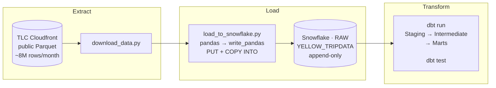
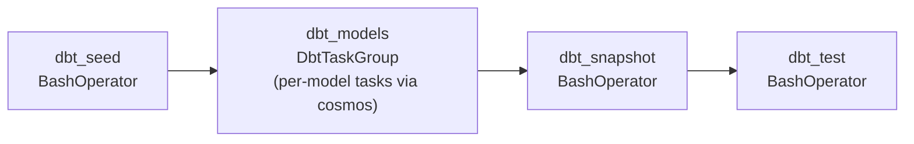
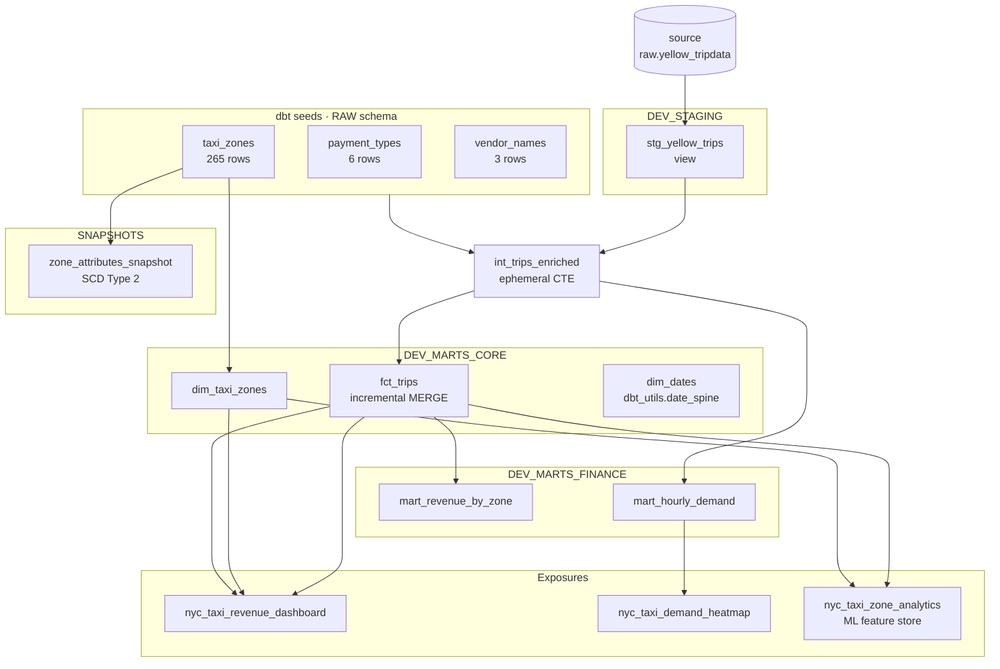

# Architecture — NYC Taxi Analytics (dbt + Snowflake)

## Overview

This is the sixth project in my data engineering portfolio, and it fills a specific gap that all five previous projects share: none of them have a proper transformation layer. In the batch ETL project I used PySpark to transform data inside Airflow. In the Databricks projects I used notebooks. The transformation logic was always entangled with the orchestration or the compute framework. This project is my answer to that — it demonstrates **analytics engineering**, the practice of managing all transformation logic as version-controlled, tested, documented SQL using dbt.

The dataset is NYC TLC Yellow Taxi Trip Records — public Parquet files published monthly by the NYC Taxi & Limousine Commission. I chose it because it has a natural star schema (trips as facts, zones and vendors as dimensions), has realistic volume (~8M rows/month), and requires no API keys or sign-ups. It is also completely different domain from everything else in my portfolio, which matters when showing breadth.

---

## The ELT Pattern



The split is intentional. The raw table in Snowflake is the single source of truth — I never modify it. If I need to fix a transformation bug, I fix the dbt model and rerun. The raw data stays intact and auditable.

- **E**: `scripts/download_data.py` downloads monthly Parquet files from TLC's public cloudfront URL
- **L**: `scripts/load_to_snowflake.py` reads the Parquet with pandas and bulk-loads into Snowflake RAW via `write_pandas` (which issues a PUT + COPY INTO internally — the fastest bulk load path for the Snowflake Python connector)
- **T**: dbt runs SQL models in dependency order, applying three transformation layers

---

## Snowflake Object Layout

```
Database: NYC_TAXI
├── RAW                       ← loaded by scripts/load_to_snowflake.py
│   ├── YELLOW_TRIPDATA       ← 24M rows of raw trip data (Jan–Mar 2024)
│   ├── TAXI_ZONES            ← 265-row seed (dbt seed)
│   ├── PAYMENT_TYPES         ← 6-row seed
│   └── VENDOR_NAMES          ← 3-row seed
│
├── DEV_STAGING (dev) / STAGING (prod)
│   └── STG_YELLOW_TRIPS      ← view: renamed, cast, deduped, surrogate key
│
├── DEV_MARTS_CORE (dev) / MARTS_CORE (prod)
│   ├── DIM_TAXI_ZONES        ← dimension: zone attributes + airport / yellow-zone flags
│   ├── DIM_DATES             ← date spine: every day 2023-01-01 to 2024-12-31
│   └── FCT_TRIPS             ← incremental fact table, clustered by pickup_date
│
├── DEV_MARTS_FINANCE (dev) / MARTS_FINANCE (prod)
│   ├── MART_REVENUE_BY_ZONE  ← monthly revenue and trip counts per pickup zone
│   └── MART_HOURLY_DEMAND    ← 168-row heatmap: trip demand by hour × weekday
│
└── SNAPSHOTS
    └── ZONE_ATTRIBUTES_SNAPSHOT  ← SCD Type 2 on taxi zone borough/service_zone
```

The `DEV_` prefix on dev schemas is produced by my custom `generate_schema_name` macro. Without it, dbt would prefix every schema with the profile's default schema name, which is messy. With it, dev runs land in `DEV_STAGING`, `DEV_MARTS_CORE` etc., and prod runs land in `STAGING`, `MARTS_CORE` etc. — the same object isolation pattern that Databricks uses with the `[dev username]` catalog prefix.

---

## dbt Model Layers

I follow the three-layer convention that most professional dbt projects use: Staging → Intermediate → Marts. Each layer has a clear contract for what it is responsible for and what it is not allowed to do.

### Layer 1: Staging (`models/staging/`)

- **Materialization**: view — staging models are never tables; they always read fresh from raw
- **Source**: `source('raw', 'yellow_tripdata')` — the only layer that touches the source macro
- **Responsibilities**:
  - Rename TLC's raw column names (`tpep_pickup_datetime` → `pickup_datetime`)
  - Cast every column to its correct data type
  - Derive `trip_duration_minutes` and `pickup_date`
  - Generate `trip_id` surrogate key via `dbt_utils.generate_surrogate_key`
  - Deduplicate via `QUALIFY ROW_NUMBER()` — TLC data has duplicates in the source
  - Filter phantom rows (null datetimes, dropoff ≤ pickup)
- **Tests**: `not_null`, `unique`, `accepted_values`, `relationships` (FK to seeds), `dbt_expectations.expect_column_values_to_be_between`

### Layer 2: Intermediate (`models/intermediate/`)

- **Materialization**: **ephemeral** — this is compiled as a CTE inside downstream models; no Snowflake table is created
- **Responsibilities**:
  - JOIN staging trips with taxi_zones seed (separately for pickup and dropoff)
  - JOIN with payment_types and vendor_names seeds
  - Apply `classify_time_of_day` macro → `time_of_day` bucket column
  - Derive `is_airport_trip`, `tip_pct`, `pickup_hour`, `pickup_day_name`

I chose ephemeral for this layer because it only exists to perform joins — there is no value in materialising it as a Snowflake object. It compiles inline into `fct_trips` and the finance marts, so Snowflake sees it as a subquery rather than an extra table scan.

### Layer 3: Marts (`models/marts/`)

- **Materialization**: table (persisted; this is what BI tools and analysts query directly)
- **core/**: Dimensional model — `dim_taxi_zones`, `dim_dates`, `fct_trips`
- **finance/**: Aggregate analytics — `mart_revenue_by_zone`, `mart_hourly_demand`

#### fct_trips — Incremental + Clustering

`fct_trips` is the most technically interesting model. It uses `materialized='incremental'` with `unique_key='trip_id'` and `incremental_strategy='merge'`:

- **First run**: full table build from all of int_trips_enriched
- **Subsequent runs**: only rows where `pickup_date > max(pickup_date)` in the existing table are processed — Snowflake only scans new partitions
- **Backfill override**: if `start_date` and `end_date` dbt variables are passed, the model filters to that window instead, allowing targeted reprocessing
- **Clustering**: `cluster_by=['pickup_date']` instructs Snowflake to co-locate micro-partitions by date — this directly parallels Liquid Clustering in the Databricks projects, and means date-range queries skip irrelevant partitions entirely

The model also enforces a **contract** (`contract: {enforced: true}` in the `.yml` file) — dbt checks that every column in the compiled SQL matches the declared column name and data type. This catches silent schema drift before it breaks a downstream BI dashboard.

---

## Macros

| Macro | What it does |
|---|---|
| `generate_schema_name` | Overrides dbt's default schema naming — dev target prepends `dev_`, prod uses the schema name as-is |
| `safe_divide(num, den)` | `IFF(den = 0 OR den IS NULL, fallback, num / den)` — prevents division-by-zero errors in mart aggregations |
| `classify_time_of_day(hour)` | CASE statement mapping 0–23 → `morning_rush / midday / evening_rush / evening / overnight` |

---

## Seeds

Seeds are CSV files that dbt loads into Snowflake as tables via `dbt seed`. They are the right pattern for small, static or slowly-changing reference data that does not come from a source system. I use three:

| Seed | Rows | Purpose |
|---|---|---|
| `taxi_zones.csv` | 265 | TLC-defined NYC taxi zones with borough and service_zone |
| `payment_types.csv` | 6 | Payment method codes and human-readable names |
| `vendor_names.csv` | 3 | TPEP provider IDs and names |

All three are loaded into the RAW schema alongside the raw trip data.

---

## Snapshot — SCD Type 2 on Zone Attributes

`snapshots/zone_attributes_snapshot.sql` tracks changes to `borough` and `service_zone` in the taxi_zones seed using `strategy='check'`. When TLC reclassifies a zone — which does happen with boundary changes — I update the CSV seed and re-run the snapshot. dbt then:

1. Finds the zone_id where `borough` or `service_zone` differs from the snapshot
2. Sets `dbt_valid_to = current_timestamp()` on the old row
3. Inserts a new row with `dbt_valid_from = current_timestamp()` and `dbt_valid_to = NULL`

The result is a full history of zone attribute changes, which means I can join trips to the snapshot on `pickup_date BETWEEN dbt_valid_from AND COALESCE(dbt_valid_to, current_timestamp())` to find out what borough a zone belonged to at the time a trip occurred — not just what it is today.

This is the declarative SQL equivalent of `APPLY CHANGES INTO ... stored_as_scd_type=2` from the Databricks ecommerce DLT project, with no streaming infrastructure required.

---

## Orchestration — Airflow + astronomer-cosmos

I added an Airflow orchestration layer to show how this pipeline would be deployed in production on a daily schedule. The DAG in `dags/nyc_taxi_pipeline.py` runs:



The `dbt_models` step uses **astronomer-cosmos**, a library that reads `target/manifest.json` and expands each dbt model into its own Airflow task, preserving dependency order. This means operators can see per-model lineage, retries, and failure status in the Airflow UI rather than treating the entire dbt run as one opaque task.

For local development I run cosmos with `InvocationMode.SUBPROCESS` to avoid a fork-safety deadlock. In a managed Airflow environment (MWAA, Astronomer) I switch to `InvocationMode.DBT_RUNNER` by setting `AIRFLOW_ENV=prod`.

---

## Data Quality

I use four complementary layers of data quality:

| Layer | dbt Test Type | Failure Behaviour |
|---|---|---|
| Staging | `not_null`, `unique`, `relationships` | warn — tracks quality without blocking |
| Staging | `dbt_expectations.expect_column_values_to_be_between` | warn — TLC data has known outliers |
| Marts | `not_null`, `unique`, `accepted_values` | error — fails `dbt test` |
| Singular tests | Custom SQL in `tests/` | error (warn on dirty-data cases) |
| Pytest | Python assertions against live Snowflake | error |

The distinction between error and warn is deliberate. I set error severity for tests that would indicate a code bug (a null trip_id, a duplicate in the fact table). I set warn severity for tests that flag real but expected data quality issues in the TLC source (negative fares from meter corrections, extreme trip durations from meters left on).

---

## Packages Used

| Package | Usage |
|---|---|
| `dbt-labs/dbt_utils` | `generate_surrogate_key` for trip_id; `date_spine` for dim_dates |
| `calogica/dbt_expectations` | `expect_column_values_to_be_between`, `expect_column_to_exist`, `expect_column_values_to_be_of_type` |

---

## Lineage DAG



Run `make dbt-docs` to view the full interactive lineage DAG in a browser.
