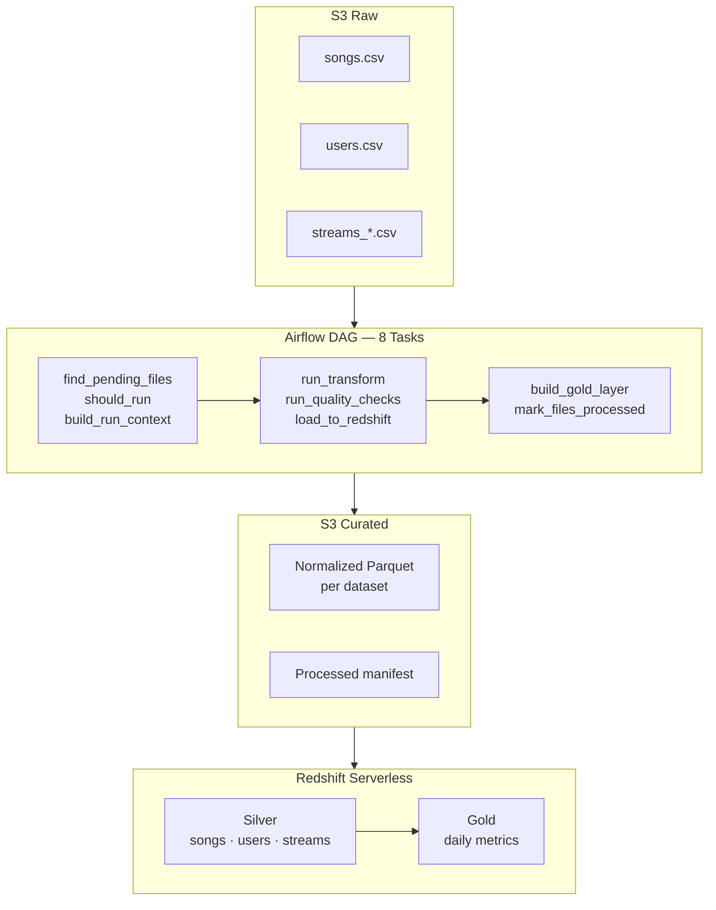

# Spotify Streams: Batch ETL Pipeline (S3 to Redshift Serverless)

A simple production-style data orchestration pipeline that I built to automate the ingestion, transformation, and loading of CSV data from S3 into Redshift Serverless, with built-in data quality checks and BI-ready gold layer aggregations.

**Orchestration**: Apache Airflow 2.9.3 (local Docker) / AWS MWAA (production)  
**Compute**: Python 3.11 with pandas  
**Warehouse**: Redshift Serverless (Data API)  
**Quality Assurance**: Great Expectations  

---

## Datasets Overview

This project simulates a **music streaming platform** data warehouse scenario. The pipeline ingests and processes three core datasets that represent different aspects of a music streaming service:

### Core Datasets

1. **Songs Dataset** (`songs.csv`)
   - Contains metadata about tracks available on the platform
   - Fields: `track_id`, `artist_name`, `track_name`, `duration_ms`, `explicit`, `release_date`
   - Primary Key: `track_id`
   - Use case: Master dimension for music catalog analysis

2. **Users Dataset** (`users.csv`)
   - Contains user profile information and demographics
   - Fields: `user_id`, `user_name`, `country`, `subscription_type`, `join_date`
   - Primary Key: `user_id`
   - Use case: User segmentation, regional analysis, subscription metrics

3. **Streams Dataset** (`streams_*.csv`)
   - Contains listening events/activity logs from users
   - Fields: `stream_event_id`, `user_id`, `track_id`, `stream_date`, `listening_duration_ms`, `country`
   - Primary Key: `stream_event_id`
   - Use case: Fact table for BI queries, streaming behavior analysis, KPI calculations

### Why This Scenario?

Music streaming data is a great real-world example because:
- **High volume**: Millions of streaming events daily across users
- **Schema variability**: Different source systems may report slightly different fields or formats
- **Quality challenges**: Duplicate events, missing values, data drift over time
- **Business value**: Clear downstream use cases (dashboards, recommendations, analytics)

---

## Problem Statement

The pipeline handles multiple CSV datasets arriving continuously in S3 — each with slightly different schemas and data quality issues — and loads them into Redshift Serverless on a 15-minute schedule. The dataset is synthesized (songs, users, streams) to model a realistic operational system.

Requirements:

1. **Automatic file detection**: Discover newly arrived CSV files in S3 without me having to babysit it
2. **Data standardization**: Normalize column names, data types, and schemas across different datasets (`songs`, `users`, `streams`)
3. **Quality validation**: Make sure bad data doesn't sneak into the warehouse using configurable rules
4. **Efficient loading**: Deduplicate and upsert data into Redshift without creating a mess of duplicates or locking tables
5. **BI-ready aggregations**: Build and maintain summary tables that dashboards can query directly
6. **Environment parity**: Run the exact same code locally in Docker and in production on AWS MWAA without any changes

The pipeline runs every 15 minutes on an Airflow schedule.

---

## Design & Architecture

### Why This Approach?

| Approach | Complexity | Local Testing | Scalability | Chosen |
|----------|-----------|---------------|-------------|--------|
| **Airflow + Python** | Low | Excellent | Good | ✅ Yes |
| Glue PySpark + Airflow | High | Difficult | Excellent | ❌ No |
| Lambda-based orchestration | Medium | Limited | Fair | ❌ No |

Airflow with Python transforms fits the data volume (hundreds of thousands of rows) without the operational overhead of Glue or the orchestration limitations of Lambda. Docker Compose gives full local parity with MWAA so the same code runs in both environments unchanged.

### System Architecture



# Key Design Patterns

## Idempotency & Deduplication

One of my core goals was to make this pipeline safe to rerun at any time without breaking anything or creating duplicates.

At the **file level**, I track processed CSV keys in an S3 manifest:

`s3://<bucket>/Project-1/schemas/music/airflow/processed_raw_files.json`

Each DAG run checks this manifest and only processes files that haven't been seen before. This keeps ingestion strictly incremental and prevents accidentally re-transforming the same source data.

At the **row level**, I use a staging-table pattern when loading into Redshift. Data gets copied into a temporary staging table first, then merged into the target using primary-key logic:

``` sql
DELETE FROM silver.table
USING staging
WHERE silver.pk = staging.pk;

INSERT INTO silver.table
SELECT * FROM staging;
```

This gives me:

-   No duplicate rows  
-   Safe retries (I can rerun without worrying)  
-   Atomic transactions  

I enforce primary keys per dataset:

-   `songs.track_id`  
-   `users.user_id`
-   `streams.stream_event_id`

Together, file-level and row-level controls make the pipeline fully
idempotent.

---

## State Management

I deliberately keep all operational state in S3 rather than storing it in the Airflow metadata database. This makes things:

-   Portable (I can rebuild Airflow and not lose my state)  
-   Auditable (it's just JSON, easy to inspect)  
-   Resilient (survives Airflow resets)  

Each run gets a timestamp-based `run_id` like:

`YYYYMMDD_HHMMSS`

Curated outputs go to run-specific paths, which makes point-in-time recovery and debugging way easier if something goes wrong.

---

## Configuration & Secrets

I wanted the same code to work in both local and production environments, so I use a simple configuration hierarchy.

### Local development (Docker)

I load environment variables from a `.env` file. This is fast and doesn't require AWS API calls, which is great for rapid development.

### Production (MWAA)

If a variable isn't found locally, the pipeline grabs it from an AWS Secrets Manager secret (`project1-config`). I cache secrets for 5 minutes to avoid hammering the AWS API.

The lookup order is:

`.env → Secrets Manager → fail`

This means I can deploy the exact same code to both environments without changing anything.

---

## Data Quality

I use Great Expectations to validate each curated dataset before it hits the warehouse. Validation rules live in `config/quality_rules.yaml` and are customizable per dataset. I check for things like:

-   Required columns  
-   Data types  
-   Null thresholds  
-   Uniqueness constraints  

When data fails validation, I have two modes:

-   **Fail-fast** -- Stop the DAG and alert me  
-   **Quarantine-and-continue** -- Log it and skip that dataset  

This gives me flexibility depending on how strict I need to be.

---

## Data Transformation

Each dataset gets dataset-specific business logic applied during the CSV→Parquet transformation stage. This is where "dirty" raw data becomes clean curated data.

### Songs Dataset Transformation
- **Duration normalization**: Convert milliseconds to seconds (divide by 1000)
- **Popularity clipping**: Enforce valid range of 0–100 (handles out-of-range values)
- **Audio feature casting**: Parse popularity, danceability, energy, tempo as numeric (coerce errors to null)
- **Artist standardization**: Convert artist names to title case for consistency

### Users Dataset Transformation
- **Age validation**: Enforce realistic range 13–120 years old (invalid values → null)
- **Country code normalization**: Uppercase ISO 3166-1 country codes
- **Subscription tier validation**: Enforce enum {free, premium, family} or map to "unknown" fallback

### Streams Dataset Transformation
- **Timestamp parsing**: Parse listen_time to ISO 8601 UTC format (`YYYY-MM-DD HH:MM:SS`)
- **Play count casting**: Convert to nullable integer (Int64), default 0 for missing
- **Session duration**: Convert milliseconds to seconds
- **Deterministic event ID**: Generate SHA256 hash from (user_id, track_id, listen_time, source_file) for deduplication
- **Duplicate flagging**: Mark duplicate events within the run (before inserting into Redshift)

All transformations are **idempotent**—rerunning the job with the same source files produces identical results.

---

## Getting Started

### Prerequisites

Before you get started, you'll need to set up a few things in AWS (one-time setup):

- **S3 bucket** with folders: `Project-1/raw/`, `Project-1/curated/music/`, `Project-1/schemas/music/`, `Project-1/mwaa/`

- **Redshift Serverless workgroup** with default configuration and minimal capacity:
  - I configured this with **8 RPUs** (Redshift Processing Units) to keep costs minimal for development
  - Database name: `dev` (or your preference)
  - **IAM Role**: Redshift automatically creates an execution role during cluster setup with basic permissions—this is fine for this use case

- **AWS Secrets Manager secret** called `project1-config` (see [MWAA_SECRETS_MANAGER_SETUP.md](docs/MWAA_SECRETS_MANAGER_SETUP.md))

#### Initializing S3 Bucket Structure

Once you've created your S3 bucket, you have three options to populate it with the required folder structure:

**Option 1: Bootstrap Script (Recommended)**
```bash
# Uses aws_bootstrap.sh to create S3 path markers (.keep files)
cd Projects/DE-Project-1
bash scripts/aws_bootstrap.sh
```
This script reads from your `.env` file and creates lightweight marker files in each S3 prefix, ensuring the paths are initialized and visible in the AWS Console.

**Option 2: Makefile Command**
```bash
cd Projects/DE-Project-1
make aws-bootstrap
```
This is a convenience wrapper around the bootstrap script, same result as Option 1.

**Option 3: AWS Console (Manual)**
- Open S3 → Your bucket → Create folders manually:
  - `Project-1/raw/`
  - `Project-1/curated/music/`
  - `Project-1/schemas/music/`
  - `Project-1/mwaa/`

All three approaches result in the same bucket structure. The script-based approaches (1 & 2) are idempotent and can be run repeatedly without issues.

### 1. Local Development with Docker

**Setup**:
```bash
# Clone and set up
git clone <repo>
cd Projects/DE-Project-1

# Copy the example env file and edit it with your AWS details
cp .env.example .env
# → Add your AWS credentials, S3 bucket, and Redshift info
```

**Start the stack**:
```bash
# Start Airflow and PostgreSQL locally
make up

# Open your browser to Airflow UI at http://localhost:8080
# Username: admin, Password: admin
```

**Verify and test**:
```bash
# (Optional) Generate some larger sample data files
make inflate-sample

# Upload sample CSVs to S3
make upload-sample

# In the Airflow UI:
# - Unpause the DAG s3_to_redshift_pipeline
# - Trigger it manually or wait 15 minutes for the schedule

# Verify results
make logs                    # Watch the execution
```

**About Sample Data**:

The project includes a synthetic data generation system for testing:

- **`sample_data_initial_load/`**: Archival reference data (original test datasets)
- **`sample_data_synthetic/`**: Generated synthetic datasets with timestamped filenames
  - `make inflate-sample`: Generate fresh CSV files (songs, users, streams partitions)
  - `make upload-sample`: Upload the generated files to S3 raw bucket
  
**Testing Workflow**:
```bash
# 1. Generate new synthetic data with fresh timestamps
make inflate-sample

# 2. Upload to S3 raw bucket
make upload-sample

# 3. Trigger DAG run (in Airflow UI or CLI)
airflow dags trigger s3_to_redshift_pipeline

# 4. Monitor execution and verify data loaded to Redshift
# See EXECUTION.md for detailed testing workflow
```

For comprehensive testing guidance, see **[EXECUTION.md](docs/EXECUTION.md)** section "Synthetic Data Generation & Testing Workflow".

**Validation checks**:
```bash
# Check if DAG completed successfully
# In Airflow UI, all 8 tasks should be green

# Query Redshift to verify data loaded
# SELECT COUNT(*) FROM silver.songs;
# SELECT * FROM gold.daily_stream_metrics LIMIT 5;
```

**Cleanup** (when done testing):
```bash
make down    # Stops containers
```

**Dockerfile (`airflow/Dockerfile`) line by line:**

```dockerfile
FROM apache/airflow:2.9.3-python3.11
```
Official Airflow image with Python 3.11. Includes Airflow, its scheduler, webserver, and all core operators — no manual installation needed.

```dockerfile
ENV PYTHONDONTWRITEBYTECODE=1 \
    PYTHONUNBUFFERED=1
```
`PYTHONDONTWRITEBYTECODE` stops Python from writing `.pyc` files into the container. `PYTHONUNBUFFERED` flushes stdout/stderr immediately so Airflow task logs appear in real time rather than after the task completes.

```dockerfile
USER root
RUN apt-get install -y --no-install-recommends build-essential
USER airflow
```
`build-essential` provides the C compiler needed by some Python packages at install time (packages with C extensions). Switched back to the `airflow` user before pip install — Airflow's image intentionally runs as non-root in production.

```dockerfile
COPY requirements-airflow.txt /requirements-airflow.txt
RUN pip install --no-cache-dir -r /requirements-airflow.txt
```
Project-specific packages installed into the Airflow image. `requirements-airflow.txt` is copied before any project code so Docker caches the pip layer — rebuilds are fast as long as the file doesn't change.

---

### 2. Production Deployment to AWS MWAA

**One-time AWS Setup** (via AWS Console):
- Create **S3 bucket** and required prefixes (`Project-1/raw/`, `Project-1/curated/music/`, `Project-1/schemas/music/`, `Project-1/mwaa/`)
- Create **Redshift Serverless workgroup** with a database
- Create **AWS Secrets Manager secret** `project1-config` with all environment variables (see [MWAA_SECRETS_MANAGER_SETUP.md](docs/MWAA_SECRETS_MANAGER_SETUP.md))
- Create **IAM execution role** for MWAA with permissions for:
  - S3 (GetObject, PutObject, ListBucket)
  - Redshift (Data API)
  - Secrets Manager (GetSecretValue)
  - SQS, CloudWatch, EC2 (for networking)
- Create **MWAA environment** with:
  - Private VPC with subnets in 2+ availability zones
  - Execution role with above permissions
  - DAG S3 path: `s3://<bucket>/Project-1/mwaa/dags/`
  - Requirements S3 path: `s3://<bucket>/Project-1/mwaa/requirements/requirements.txt`
  - Wait for status to be `AVAILABLE`

**Deploy DAG and code**:
```bash
# Upload DAG and supporting modules
aws s3 cp dags/s3_to_redshift_pipeline.py s3://<bucket>/Project-1/mwaa/dags/
aws s3 cp config/pipeline_config.yaml s3://<bucket>/Project-1/mwaa/dags/config/
aws s3 cp config/quality_rules.yaml s3://<bucket>/Project-1/mwaa/dags/config/
aws s3 cp -r src/ s3://<bucket>/Project-1/mwaa/dags/
aws s3 cp -r transform_jobs/ s3://<bucket>/Project-1/mwaa/dags/

# Upload requirements
aws s3 cp mwaa/requirements.txt s3://<bucket>/Project-1/mwaa/requirements/requirements.txt

# Wait 30-60 seconds for MWAA to sync
```

**Verify and test**:
```bash
# Log into MWAA Airflow UI
# - Unpause the DAG s3_to_redshift_pipeline
# - Trigger it manually to test
# - Monitor logs in CloudWatch
```

**Validation**:
```bash
# Verify Redshift has data
# SELECT COUNT(*) FROM silver.songs;
# SELECT COUNT(*) FROM silver.users;
# SELECT COUNT(*) FROM silver.streams;
# SELECT * FROM gold.daily_stream_metrics ORDER BY stream_date DESC LIMIT 5;
```

**What to expect**: The DAG completes successfully, curated parquet shows up in S3, and your Redshift silver + gold tables get populated with fresh data. DAG runs automatically every 15 minutes.


---

## Environment Variables

Here's the full list of variables I use. They come from either `.env` (local) or Secrets Manager (MWAA):

| Variable | What It Does | Example | Local | MWAA |
|----------|---------|---------|-------|------|
| `AWS_REGION` | Which AWS region to use | `ap-south-2` | .env | Secrets Manager |
| `S3_RAW_BUCKET` | Where the raw CSV files go | `my-bucket` | .env | Secrets Manager |
| `S3_RAW_PREFIX` | The folder path for raw CSVs | `Project-1/raw/` | .env | Secrets Manager |
| `S3_CURATED_BUCKET` | Where curated parquet files go | `my-bucket` | .env | Secrets Manager |
| `S3_CURATED_PREFIX` | The folder path for curated data | `Project-1/curated/music/` | .env | Secrets Manager |
| `S3_SCHEMA_REGISTRY_PREFIX` | Where I store schema snapshots | `Project-1/schemas/music/` | .env | Secrets Manager |
| `REDSHIFT_DATABASE` | Redshift database name | `dev` | .env | Secrets Manager |
| `REDSHIFT_WORKGROUP` | Redshift workgroup name (without `.redshift-serverless.amazonaws.com`) | `default-workgroup` | .env | Secrets Manager |
| `REDSHIFT_SECRET_ARN` | Secrets Manager secret for Redshift credentials | `arn:aws:secretsmanager:...` | .env | Secrets Manager |
| `REDSHIFT_IAM_ROLE_ARN` | IAM role for S3 COPY operations | `arn:aws:iam::...` | .env | Secrets Manager |
| `TARGET_SCHEMA` | Redshift schema for transactional data | `silver` | .env | Secrets Manager |
| `GOLD_SCHEMA` | Redshift schema for BI reports | `gold` | .env | Secrets Manager |

**How it works**:
- Locally: `make up` mounts `.env` into the container, and Airflow reads it via `os.getenv()`
- On MWAA: The DAG queries Secrets Manager on startup, caches the result for 5 minutes

---

## Project Structure

```
DE-Project-1/
├── dags/
│   └── s3_to_redshift_pipeline.py         # Main Airflow DAG orchestration
│
├── src/
│   ├── common/
│   │   ├── config.py                      # Config loader (YAML + Secrets Manager)
│   │   └── datasets.py                    # Dataset detection/grouping utilities
│   ├── loaders/
│   │   └── redshift_loader.py             # Redshift Data API + SQL execution
│   └── quality/
│       └── ge_validator.py                # Great Expectations validation runner
│
├── transform_jobs/
│   └── csv_to_curated_transform_job.py   # CSV → Parquet transform + metadata
│
├── config/
│   ├── pipeline_config.yaml               # Pipeline defaults + schedule
│   └── quality_rules.yaml                 # Dataset-specific validation rules
│
├── sql/
│   └── 001_bootstrap.sql                  # Redshift schema initialization
│
├── scripts/
│   ├── start_local.sh                     # Docker Compose starter
│   ├── inflate_sample_data.py             # Generate synthetic CSV data
│   ├── upload_sample_data_to_s3.py        # Upload samples to S3 raw prefix
│   ├── run_local_transform.sh             # Debug transform job outside Airflow
│   └── deploy_mwaa_artifacts.sh           # Package and upload to MWAA S3
│
├── tests/
│   ├── test_dag_import.py                 # DAG syntax validation
│   ├── test_datasets.py                   # Dataset helper unit tests
│   └── test_transform_utils.py            # Transform logic unit tests
│
├── sample_data/
│   ├── songs.csv
│   ├── users.csv
│   └── streams*.csv
│
├── docker-compose.yml                     # Local Airflow + PostgreSQL
├── airflow/Dockerfile                     # Airflow image definition
├── requirements-airflow.txt               # Local runtime dependencies
├── mwaa/requirements.txt                  # MWAA runtime dependencies
├── Makefile                               # Development commands
├── .env.example                           # Environment variables template
└── README.md                              # This file
```

---

## Testing

```bash
# Run all unit tests
make test

# Run specific test file
pytest tests/test_dag_import.py -v

# Lint code with ruff
make lint

# Format code with ruff
make fmt

# Syntax check before deployment
python3 -m py_compile src/common/config.py dags/s3_to_redshift_pipeline.py
```

**Coverage**:
- ✅ DAG import smoke test (validates Airflow syntax)
- ✅ Dataset parsing tests (column inference, grouping logic)
- ✅ Transform utility tests (column normalization)
- ✅ Local Docker integration tests (full end-to-end flow)
- ✅ All 5 unit tests pass on both Python 3.11 + Airflow 2.9.3

---

## Documentation

- **[EXECUTION.md](docs/EXECUTION.md)**: Detailed walkthrough of local and production execution flows
- **[MWAA_SECRETS_MANAGER_SETUP.md](docs/MWAA_SECRETS_MANAGER_SETUP.md)**: Step-by-step AWS Secrets Manager configuration (secret creation, IAM permissions, verification)
- **[Makefile](Makefile)**: All available development and deployment commands

---

## Development Commands

```bash
make up                       # Start local Airflow + PostgreSQL
make down                     # Stop and remove containers
make logs                     # Tail Airflow logs
make test                     # Run all unit tests
make lint                     # Run linter (ruff)
make fmt                      # Format code (ruff)
make aws-bootstrap            # Create S3 prefix markers (requires .env)
make inflate-sample           # Generate larger CSV files for testing
make upload-sample            # Upload sample CSVs to S3 raw prefix
make deploy-mwaa              # Package and upload to MWAA S3 paths
```

---

## Architecture Decisions & Trade-offs

### Why S3 Manifest Instead of DB?
- **Why**: I don't want to depend on a persistent database just to track file state
- **Benefit**: It's portable, auditable, and survives Airflow resets
- **Trade-off**: Slightly slower than in-memory caching (requires an S3 API call)

### Why Staging Table for Redshift Loads?
- **Why**: I need atomic dedupe and insert operations without locking the whole table
- **Benefit**: No query blocking during loads
- **Trade-off**: I write data twice (staging table + final insert), which is a bit more I/O

### Why Great Expectations Instead of Custom Validation?
- **Why**: It's a standardized framework with tons of built-in checks
- **Benefit**: Configurable rules, good documentation, and I can reuse it across projects
- **Trade-off**: One more dependency to manage; takes a minute to learn the syntax

### Why Secrets Manager Caching Instead of File-Based Secrets?
- **Why**: Centralized, audit-friendly, and I can rotate credentials without code changes
- **Benefit**: Production-grade security without operational headaches
- **Trade-off**: AWS API latency (though I mitigate this with 5-minute caching); requires IAM setup

---

## Performance Characteristics

- **Typical DAG runtime**: 2–5 minutes (100K–500K rows across 3 datasets)
- **Redshift query time**: Sub-second for silver tables; 1–3 seconds for gold aggregations
- **Secrets Manager API**: ~100ms first call, ~1ms cached (5-minute TTL)
- **S3 operations**: Parallel reads/writes via pandas/pyarrow
- **Data growth**: Processed manifest grows ~5–10 entries per day

---

## Troubleshooting

| Issue | Root Cause | Solution |
|-------|-----------|----------|
| DAG fails with `Missing required environment variable` | MWAA has no `.env` file; Secrets Manager secret missing or no permissions | See [MWAA_SECRETS_MANAGER_SETUP.md](docs/MWAA_SECRETS_MANAGER_SETUP.md) to create secret and grant IAM permissions |
| Airflow UI not accessible locally | Webserver container failed to start | Run `docker compose logs airflow-webserver` to see errors; verify port 8080 not in use |
| Redshift connection timeout | Security group doesn't allow outbound HTTPS; wrong workgroup endpoint | Add outbound rule to security group for port 443; verify `REDSHIFT_WORKGROUP` in `.env` |
| DAG imports slowly on MWAA | Heavy imports at top of DAG file | Move imports into task functions; use PythonOperator for lazy loading |
| Duplicate rows in silver table | Primary key mismatch between staging and silver | Verify primary key definition in `sql/001_bootstrap.sql`; check for NULL values in key columns |
| Gold table not updating | Query failed silently | Check `silver.pipeline_audit` for error messages; review `run_quality_checks` task logs |


---
