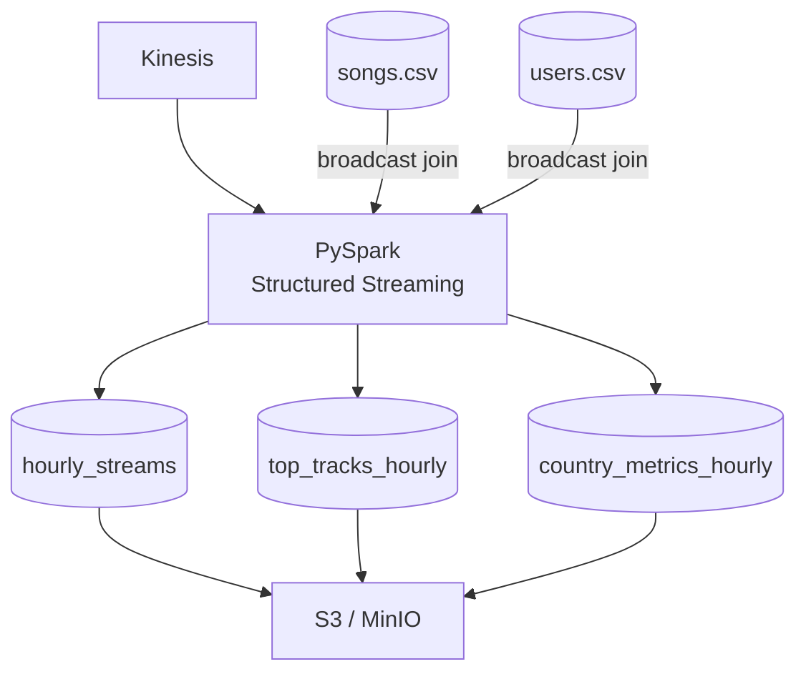

# Spotify Streams: Real-Time Analytics Pipeline (Kinesis and Spark)

A continuation of the Spotify Streams batch pipeline using the same music streaming dataset, redesigned for stream-based processing. A PySpark Structured Streaming job reads live music events from Kinesis, joins them with song/user metadata, and writes 5-minute windowed aggregations to S3 as Parquet. Runs entirely in Docker locally using LocalStack and MinIO — no AWS account needed to test.

**Stack**: PySpark 3.5 · Kinesis · Parquet on S3  
**Local testing**: Docker (Spark + LocalStack + MinIO)  
**Production**: AWS Glue Streaming (primary) · EMR Serverless (alternative, pending [Issue #79](https://github.com/awslabs/spark-sql-kinesis-connector/issues/79))

---

## What It Does

Reads `{user_id, track_id, timestamp, event_type}` events from Kinesis, enriches them with broadcast-joined dimension tables, and produces three 5-minute windowed aggregations:

| Output Table | Contents |
|---|---|
| `hourly_streams/` | Stream counts per track and country |
| `top_tracks_hourly/` | Tracks ranked by play count |
| `country_metrics_hourly/` | Unique users and tracks per country |

Results land as partitioned Parquet in MinIO (local) or S3 (production), queryable via Athena.

---

## Architecture



One script, two deployment modes — only `--trigger-mode` changes:

| Deployment | Mode | Cost |
|---|---|---|
| AWS Glue Streaming | `continuous` — always-on, sub-minute latency | ~$21/day |
| EMR Serverless | `available_now` — drain & exit every 30 min | ~$0.50–1/day (blocked — see [TROUBLESHOOTING.md G5](docs/TROUBLESHOOTING.md)) |

---

## Project Structure

```
spotify-streams-realtime-pipeline/
├── docker-compose.yml
├── Makefile
├── .env.example                     # copy to .env before first run
│
├── jars/                            # not committed — build/download once (see below)
│   ├── spark-streaming-sql-kinesis-connector_2.12-1.4.2.jar
│   ├── hadoop-aws-3.3.4.jar
│   └── aws-java-sdk-bundle-1.12.565.jar
│
├── scripts/
│   ├── kinesis_stream_producer.py   # generates synthetic events
│   └── spark_aggregator.py          # main PySpark job
│
├── src/utils/
│   ├── dimension_loader.py
│   └── event_parser.py
│
├── sample_data_initial_load/
│   ├── songs.csv
│   └── users.csv
│
└── docs/
    ├── EXECUTION.md
    ├── LOCAL_DEVELOPMENT_SETUP.md
    ├── GLUE_DEPLOYMENT.md
    ├── AWS_PRODUCTION_DEPLOYMENT.md
    └── TROUBLESHOOTING.md
```

---

## Running Locally

### One-time setup (fresh clone)

The Kinesis connector JAR is not committed to git. Build it once:

```bash
make build-kinesis-jar   # ~3 min, requires Docker
```

Also download the two S3A support JARs into `jars/`:

```bash
curl -L -o jars/hadoop-aws-3.3.4.jar \
  https://repo1.maven.org/maven2/org/apache/hadoop/hadoop-aws/3.3.4/hadoop-aws-3.3.4.jar

curl -L -o jars/aws-java-sdk-bundle-1.12.565.jar \
  https://repo1.maven.org/maven2/com/amazonaws/aws-java-sdk-bundle/1.12.565/aws-java-sdk-bundle-1.12.565.jar
```

All three JARs must exist before running `make up` — they're baked into the Docker image.

### Step 1 — Start containers

```bash
make up
docker compose ps   # wait for all 3 to show healthy
```

| Container | Role | Port |
|---|---|---|
| `etl-project-2-spark` | runs the PySpark job | 4040 (Spark UI) |
| `etl-project-2-localstack` | mocks Kinesis | 4566 |
| `etl-project-2-minio` | mocks S3 | 9000 (API), 9001 (console) |

### Step 2 — Create the MinIO bucket

Open **http://localhost:9001** (minioadmin / minioadmin), create bucket **`etl-project-2-data`**, and upload `songs.csv` and `users.csv` into the bucket root. Do this after every `make up` — `make down` wipes the volume.

### Step 3 — Run the producer

```bash
make producer
```

Sends 20 synthetic events every 5 seconds to `music-streams` on LocalStack. The stream is auto-created on first run.

### Step 4 — Run the aggregator

In a second terminal:

```bash
make consumer
```

Reads from Kinesis, joins with dimension tables, writes Parquet to `s3a://etl-project-2-data/aggregations/`. First Parquet output appears after ~5 minutes (one window closes).

> **TRIM_HORIZON:** The consumer always reads from the start of the shard. If the producer ran first, Spark replays the backlog before catching up — no events are lost. Event-time windowing ensures backlogged records land in their correct original windows.

### Step 5 — Browse results

**http://localhost:9001** → `etl-project-2-data` → `aggregations/` — three folders partitioned by `window_start`.

Spark UI at **http://localhost:4040** → Structured Streaming shows all 3 active queries.

### Step 6 — Tear down

```bash
make down
```

---

## Docker Setup

Three containers, one network.

**`etl-project-2-localstack`** mocks Kinesis at `http://localhost:4566`. The Spark container waits on LocalStack's healthcheck before starting.

**`etl-project-2-minio`** mocks S3 at `http://localhost:9000`. Parquet output lands here instead of real S3 during local runs.

**`etl-project-2-spark`** is the PySpark runtime, built from the project Dockerfile.

**Dockerfile line by line:**

```dockerfile
FROM apache/spark:3.5.0-python3
```
Official Apache Spark image with Python 3. Includes the JVM, Spark binaries, and PySpark — no manual Java or Spark installation needed.

```dockerfile
ENV PYTHONDONTWRITEBYTECODE=1 \
    PYTHONUNBUFFERED=1
```
`PYTHONDONTWRITEBYTECODE` stops Python from writing `.pyc` files into the container filesystem. `PYTHONUNBUFFERED` flushes stdout/stderr immediately — without this, log output only appears after the script finishes, making debugging inside Docker much harder.

```dockerfile
USER root
RUN pip install --no-cache-dir \
    boto3==1.26.137 \
    python-dotenv==1.0.0 \
    pyarrow==11.0.0
```
Additional packages installed as root. `boto3` handles MinIO/S3 API calls; `pyarrow` is the Parquet engine used by Spark. Pinned to exact versions to match the connector JARs.

```dockerfile
RUN mkdir -p /home/spark/.ivy2/cache && \
    chown -R spark:spark /home/spark/.ivy2
```
Spark resolves JARs at runtime via Ivy. Without this, the `spark` user can't write to the Ivy cache and JAR resolution fails at startup.

```dockerfile
COPY scripts/ /opt/spark/scripts/
COPY src/ /opt/spark/src/
COPY jars/ /opt/spark/jars/
```
Bakes the PySpark job, utilities, and connector JARs into the image. The JARs are pre-built locally (see Quick Start) — they're not downloaded at runtime.

```dockerfile
USER spark
ENV PYTHONPATH="/opt/spark/src:/opt/spark/scripts:$PYTHONPATH"
```
Drops privileges back to the non-root `spark` user. `PYTHONPATH` makes the `utils/` module importable without packaging.

```dockerfile
CMD ["tail", "-f", "/dev/null"]
```
Keeps the container running. The PySpark job is launched explicitly via `make consumer` — the container is just the execution environment.

---

## Design Choices

**Broadcast joins** — songs and users are small static tables; broadcasting them avoids any shuffle on the streaming side.

**`foreachBatch` + `coalesce`** — intercepts each micro-batch to consolidate output into one file per window partition instead of hundreds of small fragments.

**`--local` flag** — switches endpoints from LocalStack/MinIO to real AWS. Same script, no code changes between environments.

**`outputMode("append")`** — each closed window is written exactly once. Correct for event-time windowed aggregations.

---

## Makefile Reference

```bash
make up                  # start containers
make down                # stop + wipe volumes
make producer            # run producer (LocalStack)
make consumer            # run aggregator (MinIO output)
make build-kinesis-jar   # build v1.4.2 connector JAR from source

make aws-producer        # run producer against real AWS Kinesis
make glue-start          # start Glue Streaming job
make glue-status         # check latest Glue run
make emr-start           # submit EMR Serverless job (set EMR_APP_ID + EMR_EXECUTION_ROLE_ARN)
make emr-status          # check EMR job status
```

---

## Docs

| File | What's in it |
|---|---|
| [`EXECUTION.md`](docs/EXECUTION.md) | Full local run guide with expected output |
| [`LOCAL_DEVELOPMENT_SETUP.md`](docs/LOCAL_DEVELOPMENT_SETUP.md) | Container networking, env vars, config reference |
| [`GLUE_DEPLOYMENT.md`](docs/GLUE_DEPLOYMENT.md) | AWS deployment — Glue Streaming (primary) + EMR Serverless (alternative) |
| [`TROUBLESHOOTING.md`](docs/TROUBLESHOOTING.md) | Every error encountered, cause and fix |

---

**Region**: `ap-south-2` · **Status**: local pipeline tested · Glue Streaming deployed
